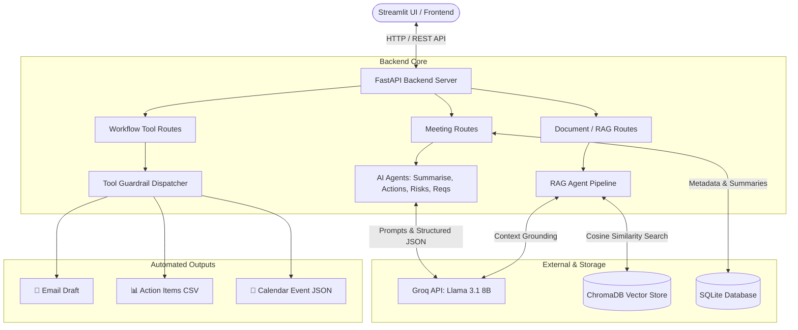

# Meeting-to-Action Agent

> Transform meeting transcripts into structured, actionable intelligence using AI.

[](https://python.org)
[](https://fastapi.tiangolo.com)
[]()

---

## What It Does

Upload a raw meeting transcript → get back a fully structured analysis in seconds:

| Output | Description |
|---|---|
| **Summary** | 2-4 sentence overview of the meeting |
| **Key Topics** | Main themes discussed |
| **Decisions** | Explicit decisions made |
| **Action Items** | Tasks with owner, deadline, priority |
| **Requirements** | Technical/business requirements extracted |
| **Risks** | Identified blockers with mitigations |
| **Markdown Report** | Notion/Confluence-ready formatted report |

Plus a **RAG knowledge base** — ingest your documents and ask questions against them.

---

## Architecture & System Flow



---

## Tech Stack

| Layer | Technology |
|---|---|
| Backend API | FastAPI + Uvicorn |
| LLM Inference | Groq (Llama 3.1 8B Instant) — free tier |
| Agent Framework | LangChain |
| Vector Database | ChromaDB (local, persistent) |
| Storage | SQLite + aiosqlite (async) |
| Frontend | Streamlit |
| Validation | Pydantic v2 |
| Testing | pytest + pytest-asyncio |

---

## Project Structure

```
meeting-to-action-agent/
├── app/
│   ├── main.py                  # FastAPI app — lifespan, routers, middleware
│   ├── config/
│   │   ├── settings.py          # Pydantic BaseSettings — typed env vars
│   │   ├── logging.py           # Structured logging setup
│   │   └── database.py          # SQLite + aiosqlite init
│   ├── routes/
│   │   ├── meetings.py          # POST /meetings/upload, /summarise, /report
│   │   ├── documents.py         # POST /documents/ingest, /ask
│   │   └── tools.py             # POST /tools/run, /meetings/{id}/automate
│   ├── agents/
│   │   ├── summarise_agent.py   # Groq LLM → structured JSON summary
│   │   ├── extraction_agents.py # Action items, requirements, risks extractors
│   │   └── rag_agent.py         # ChromaDB + Groq RAG pipeline
│   ├── services/
│   │   ├── meeting_service.py   # SQLite CRUD for meetings + summaries
│   │   └── report_service.py    # Markdown + JSON report generation
│   ├── tools/
│   │   └── workflow_tools.py    # Email draft, CSV export, calendar events
│   ├── schemas/
│   │   ├── meeting.py           # Meeting request/response models
│   │   ├── report.py            # Report response model
│   │   ├── rag.py               # RAG ingest/Q&A models
│   │   └── tools.py             # Tool workflow models
│   └── prompts/
│       ├── summarise.txt        # Main summarisation prompt
│       ├── action_items.txt     # Action item extraction prompt
│       ├── requirements.txt     # Requirements extraction prompt
│       ├── risks.txt            # Risk extraction prompt
│       └── rag_qa.txt           # RAG Q&A prompt
├── frontend/
│   └── app.py                   # Streamlit UI — all phases
├── tests/
│   ├── test_phase1.py           # Upload, health, summarise endpoints
│   ├── test_phase2.py           # Report endpoint, JSON extraction
│   ├── test_phase3.py           # RAG ingest, Q&A, chunk utilities
│   └── test_phase4.py           # Tool guardrails, email/CSV/calendar
├── .env.example                 # Environment variable template
├── requirements.txt             # Python dependencies
└── pytest.ini                   # pytest configuration
```

---

## Quick Start

### 1. Clone & set up environment
```bash
git clone https://github.com/harman-singh/meeting-to-action-agent
cd meeting-to-action-agent
python -m venv .venv
source .venv/bin/activate        # Windows: .venv\Scripts\activate
pip install -r requirements.txt
```

### 2. Configure environment variables
```bash
cp .env.example .env
# Edit .env and add your GROQ_API_KEY
```

Get a free Groq API key at [console.groq.com](https://console.groq.com) — no credit card required.

### 3. Run the backend
```bash
uvicorn app.main:app --reload
# API available at http://localhost:8000
# Interactive docs at http://localhost:8000/docs
```

### 4. Run the frontend
```bash
# In a new terminal
pip install streamlit httpx
streamlit run frontend/app.py
# UI available at http://localhost:8501
```

---

## API Reference

### Meetings

| Method | Endpoint | Description |
|---|---|---|
| `POST` | `/meetings/upload` | Upload a transcript |
| `POST` | `/meetings/{id}/summarise` | Run AI analysis |
| `GET` | `/meetings/{id}` | Get meeting + summary |
| `GET` | `/meetings/{id}/report` | Get Markdown + JSON report |
| `GET` | `/meetings/` | List all meetings |

### Documents (RAG)

| Method | Endpoint | Description |
|---|---|---|
| `POST` | `/documents/ingest` | Ingest text into knowledge base |
| `POST` | `/documents/ingest/file` | Upload file (TXT, MD, PDF) |
| `POST` | `/documents/ask` | Ask a question against the KB |

### Tools

| Method | Endpoint | Description |
|---|---|---|
| `GET` | `/tools/` | List available tools |
| `POST` | `/tools/run` | Run tool on action items |
| `POST` | `/tools/meetings/{id}/automate` | Run tool from meeting's action items |

**Available tools:** `email_draft` · `csv_export` · `calendar_event`

---

## Example Usage

```bash
# 1. Upload a transcript
curl -X POST http://localhost:8000/meetings/upload \
  -H "Content-Type: application/json" \
  -d '{"transcript": "Alice: We need to ship the payment integration by Sep 15. Bob: I will own that.", "title": "Q3 Planning"}'

# 2. Summarise it
curl -X POST http://localhost:8000/meetings/{meeting_id}/summarise

# 3. Generate email from action items
curl -X POST http://localhost:8000/tools/meetings/{meeting_id}/automate \
  -H "Content-Type: application/json" \
  -d '{"tool_name": "email_draft"}'
```

---

## Running Tests

```bash
pytest tests/ -v
# 37 tests — Phases 1-4 fully covered
```

---

## Design Decisions

**Why Groq?** Free tier with extremely fast inference (Llama 3.1 8B). No credit card needed — perfect for portfolio projects.

**Why ChromaDB over FAISS?** FAISS + sentence-transformers requires ~700MB of PyTorch. ChromaDB uses ONNX embeddings internally — installs in seconds and works out of the box.

**Why separate prompts from code?** Each prompt is a `.txt` file. You can tune the AI behaviour without touching Python — just edit the prompt and restart.

**Why tool guardrails?** All tool calls pass through a single `dispatch_tool()` validator. Unknown tool names are rejected before any execution — prevents injection of arbitrary operations.

---
